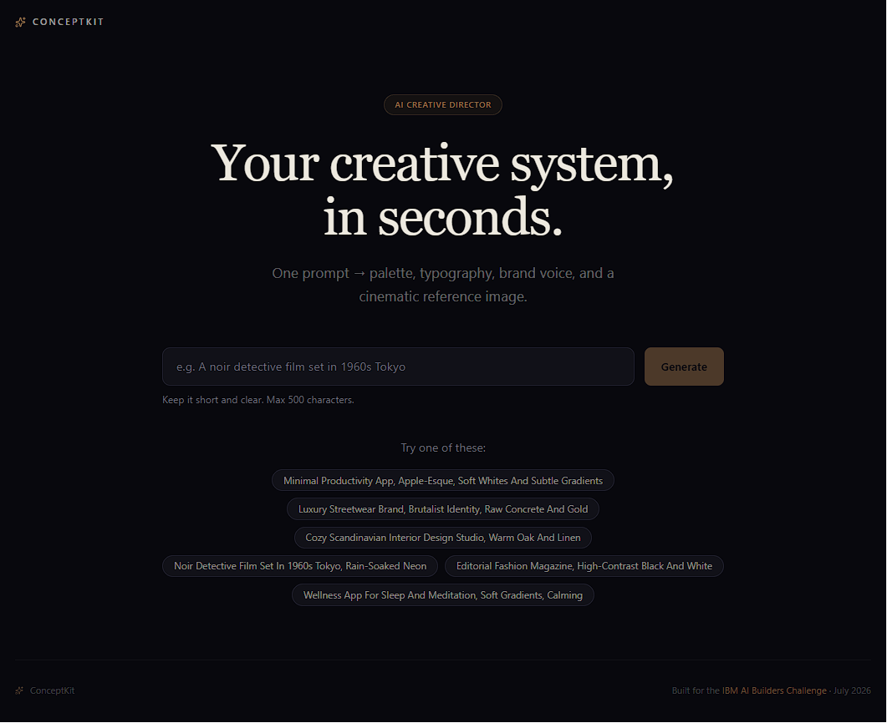

# ConceptKit

> Your AI creative director. Turn a single sentence into a full visual concept - palette, typography, mood, voice, and reference imagery - in under 10 seconds.



ConceptKit is built for the **IBM AI Builders Challenge (July 2026)** under the *"Reimagine Creative Industries with AI"* theme. It is an AI creative partner for designers, filmmakers, marketers, and indie builders who need to go from a vague idea to a coherent visual direction without opening Figma, Pinterest, or five browser tabs.

## What it does

Give ConceptKit a one-line idea. It returns a **complete creative direction**:

- **Brand summary** - one paragraph framing the concept
- **Brand personality** - 3–5 adjectives that guide every visual decision
- **Audience** - who the concept is for and how it speaks to them
- **Mood keywords** - 5 single words that anchor the vibe
- **Visual language** - concrete aesthetic direction (e.g. *"editorial, soft grain, generous negative space"*)
- **Color palette** - 5 hex colors with semantic roles (primary / secondary / accent / neutral / background) and a rationale for each
- **Typography pairing** - heading + body fonts with a reason for the choice
- **Voice** - how the brand writes
- **Reference images** - 4 AI-generated mood images, each with the prompt used to create it

Every concept is shareable via a unique URL (e.g. `/c/aB3xYkL9mN`).

## Problem

Creative professionals spend 30–90 minutes on the *first step* of any project: building a moodboard. They bounce between Pinterest, Dribbble, Google Fonts, Coolors, and image generators, copy-pasting hex codes into a Google Doc, then rewriting the brief because the fonts don't match the palette. ConceptKit compresses that workflow into a single prompt and a single page.

## Solution

ConceptKit is a single-page web app that:

1. Takes a natural-language concept (e.g. *"a quiet productivity app for people who hate productivity apps"*)
2. Sends a structured prompt to an LLM that returns a strict JSON schema
3. Validates the schema, then enriches each item with rationale and visual reasoning
4. Generates 4 reference images via Pollinations.ai (Flux model) using the visual language
5. Renders a unified design system view with copy-to-clipboard color codes
6. Persists the result and gives the user a shareable link

## AI approach and architecture

**Primary development tool:** IBM Bob (used for code generation, refactoring, and project scaffolding throughout the build)

**LLM - creative direction:** Meta Llama 3.3 70B Instruct via Hugging Face's OpenAI-compatible router (`router.huggingface.co/v1/chat/completions`)
- Strict JSON schema via system prompt; Zod-validated on the server
- Single-pass generation with deterministic temperature (0.7) for creative-but-coherent output
- System prompt lives in `lib/prompts/creativeStrategy.ts`

**LLM - palette and typography rationale:** Same Llama 3.3 endpoint, separate specialized prompt in `lib/prompts/designSystem.ts`
- Pulls colors and font pairings out of the creative direction
- Returns per-color role and per-font rationale

**Image generation:** [Pollinations.ai](https://pollinations.ai) (Flux model) - free, no key required
- Each reference image is generated from the visual language + a per-image prompt derived from the concept
- Direct URL fetch, no SDK

**Storage:** Filesystem JSON in `.next/cache/conceptkit/` (dev) or `/tmp/conceptkit/` (Vercel serverless) - see `lib/store.ts`

**Architecture diagram:**

```
User input (1 line)
       │
       ▼
┌──────────────────┐
│  Next.js API     │
│  /api/generate   │
└──────────────────┘
       │
       ├─► HF Router (Llama 3.3 70B) ──► Creative direction JSON
       ├─► HF Router (Llama 3.3 70B) ──► Palette + typography rationale
       └─► Pollinations.ai (Flux)  ──► 4 reference images
       │
       ▼
┌──────────────────┐
│  Zod validation  │
│  + persistence   │ ──► /c/{id} shareable URL
└──────────────────┘
       │
       ▼
┌──────────────────┐
│  React frontend  │
│  ConceptResult   │
│  view            │
└──────────────────┘
```

## Challenge fit

This directly addresses the *Reimagine Creative Industries with AI* theme:

- ✅ **AI creative partner** - ConceptKit *is* an AI creative partner
- ✅ **Storytelling and content creation tools** - every concept includes a voice and mood
- ✅ **Creative ideation and brainstorming platforms** - the *first* step of any project
- ✅ **Personalized creative assistants** - adapts to any domain the user describes
- ✅ **AI-powered design and visual concept tools** - outputs a complete visual system

It answers the brief's three core questions:

| Brief question | How ConceptKit answers it |
|---|---|
| How can AI enhance creativity? | It removes the blank-page problem - gives you a *direction*, not a *result* |
| How can AI help people create faster? | 30–90 minutes of moodboard work → under 10 seconds |
| How can AI act as a creative partner rather than simply a content generator? | Outputs are starting points with rationale, not final assets - the human still curates |

## How IBM Bob was used

IBM Bob was the **primary development tool** for this project. It was used for:

- **Project scaffolding** - initial Next.js 14 + TypeScript + Tailwind structure
- **Component generation** - `ConceptForm`, `ConceptResult`, `LoadingSkeleton`, `EmptyState`, `ErrorState`
- **Prompt engineering** - iterating on the creative-direction system prompt to enforce strict JSON output
- **Refactoring** - splitting the monolithic generate route into composable prompt modules
- **Security patches** - Next.js 14.2.5 → 14.2.35 (CVE-2025-55183, CVE-2025-55184, CVE-2025-67779)
- **Debugging** - diagnosing the Vercel filesystem storage issue and routing fix

Bob was used as a **pair-programming collaborator** - every architectural decision and every line of complex logic was reviewed and understood before being committed.

## Tech stack

| Layer | Choice | Why |
|---|---|---|
| Framework | Next.js 14 (App Router) | Server components for the share view, route handlers for the API |
| Language | TypeScript (strict) | Catches schema mismatches at compile time |
| Styling | Tailwind CSS | Fast iteration on the design-system view |
| LLM | Meta Llama 3.3 70B (HF Router) | Free, OpenAI-compatible, strong at structured JSON |
| Image gen | Pollinations.ai (Flux) | Free, no key, fast enough for live demo |
| Storage | Filesystem JSON | Zero-config, works on Vercel serverless in `/tmp` |
| Icons | lucide-react | Lightweight, consistent |
| Deployment | Vercel | Zero-config Next.js hosting |

## Getting started

```bash
git clone https://github.com/realwarp/conceptkit
cd conceptkit
npm install
npm run dev
```

Open [http://localhost:3000](http://localhost:3000), type a concept, hit generate.

No API keys required - Pollinations is keyless and the HF Router has a generous free tier.

## Project structure

```
app/
├── api/
│   └── generate/route.ts   # POST endpoint, orchestrates LLM + image gen
├── c/[id]/page.tsx         # Shareable concept view
├── layout.tsx              # Root layout
├── page.tsx                # Home - input form
└── globals.css
components/
├── ConceptForm.tsx         # Input form + submit handler
├── ConceptResult.tsx       # Main result view (palette, type, images, etc.)
├── EmptyState.tsx
├── ErrorState.tsx
└── LoadingSkeleton.tsx
lib/
├── prompts/
│   ├── creativeStrategy.ts # LLM prompt for the core creative direction
│   └── designSystem.ts     # LLM prompt for palette + typography
├── store.ts                # Filesystem JSON storage
└── types.ts                # ConceptResult, Color, Typography, etc.
```

## Submission

- **Hackathon:** IBM AI Builders Challenge - July 2026
- **Challenge theme:** *Reimagine Creative Industries with AI*
- **Deadline:** July 31, 2026, 11:59 PM ET
- **Demo video:** [link to be added before submission]
- **Submission page:** [BeMyApp platform link]

## License

MIT
